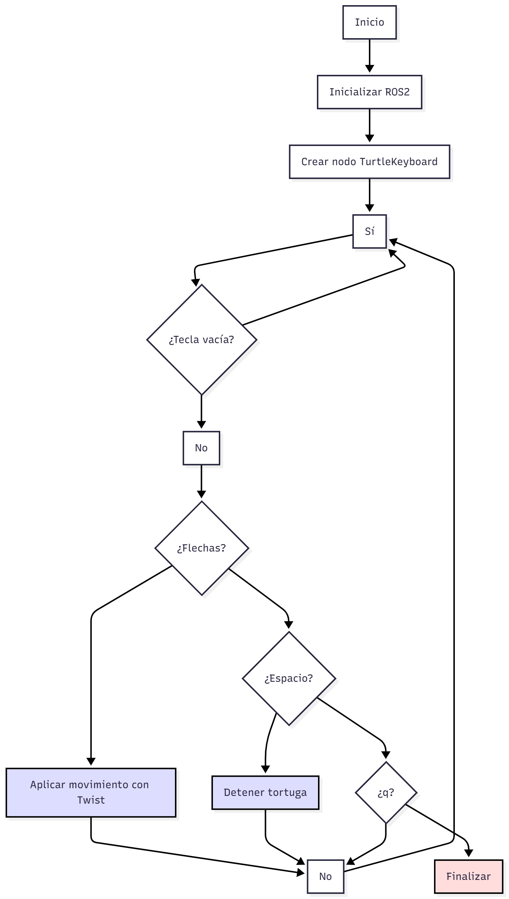
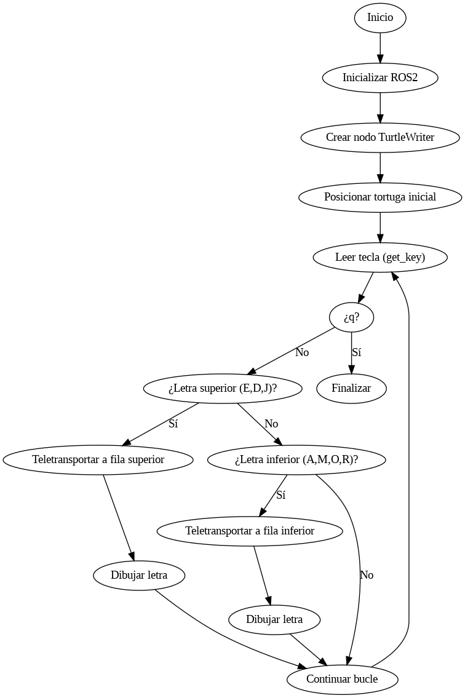

# Informe de Laboratorio 04 – Robótica de Desarrollo (ROS 2 Humble – Turtlesim)
<p align="center">

</p>


### Autores:  
Esteban Durán Jiménez  
Ana María Orozco Reyes  

**FACULTAD DE INGENIERÍA**  
**ROBÓTICA**  
**2025-II**

---


## 📘 **Documentación del Desarrollo**

### **1. Objetivo General del Proyecto**

El objetivo del laboratorio fue implementar un sistema de control para el simulador **Turtlesim** utilizando ROS 2 Humble, permitiendo:

* Control manual de la tortuga mediante el teclado (flechas).
* Dibujo automático de letras basadas en las iniciales de los integrantes del equipo.
* Gestión completa del movimiento desde scripts propios, sin usar el nodo `turtle_teleop_key`.

---

### **2. Procedimiento Realizado**

#### **2.1. Configuración del entorno**

Se creó un workspace de ROS 2 y dentro de este se implementaron dos scripts principales:

* **move_turtle.py** → encargado del control manual.
* **draw_initials.py** → encargado del dibujo automático de letras.

Ambos scripts fueron ejecutados desde nodos de ROS 2 utilizando `rclpy`.

---

### **2.2. Implementación del Control Manual (move_turtle.py)**

1. **Lectura de teclado sin bloqueo**
   Se implementó la función `get_key()` usando:

   * `termios`, `tty` y `select`
     para leer una tecla sin detener la ejecución del programa.
     Esto permite detectar:

   * Flechas ↑ ↓ ← →

   * Espacio para detener

   * `q` para salir

2. **Creación del nodo `TurtleKeyboard`**
   El nodo publica mensajes del tipo `Twist` en `/turtle1/cmd_vel`.
   Este mensaje contiene:

   * `linear.x` → velocidad hacia adelante/atrás
   * `angular.z` → rotación

3. **Asignación de teclas**
   Las flechas generan secuencias (`ESC [ A/B/C/D`) que se interpretan para producir:

   * **↑** avanzar
   * **↓** retroceder
   * **→** girar a la derecha
   * **←** girar a la izquierda

4. **Control de movimiento**
   Cada tecla envía un `Twist` con velocidades configuradas por:

   ```python
   LIN_SPEED = 2.0
   ANG_SPEED = 2.0
   ```

5. **Terminación segura**
   El script detiene la tortuga y destruye el nodo al salir, garantizando un cierre limpio del sistema.

---

### **2.3. Implementación del Dibujo de Letras (draw_initials.py)**

1. **Nodos y servicios utilizados**
   Este script crea el nodo `TurtleWriter`, el cual utiliza:

   * Publicador a `/turtle1/cmd_vel`
   * Servicio `/turtle1/teleport_absolute` para mover la tortuga sin dibujar
   * Servicio `/turtle1/set_pen` para activar/desactivar el lápiz

2. **Funciones generales de movimiento**

   * `move()` → mueve con velocidad constante durante un tiempo.
   * `go_to()` → teletransporta la tortuga a una posición inicial sin trazar.

3. **Definición de letras**
   Se implementaron funciones independientes para escribir cada letra:

   * **E, D, J**
   * **A, M, O, R**

   Cada letra se construye mediante combinaciones de movimientos lineales y giros controlados.

4. **Separación de registro de letras**
   El script divide el tablero en dos zonas:

   * `x_top`, `y_top` → letras E–D–J
   * `x_bottom`, `y_bottom` → letras A–M–O–R

   Cada vez que se dibuja una letra, el cursor se desplaza horizontalmente usando `spacing`.

5. **Lógica principal (`run()`)**

   * Espera teclas del usuario.
   * Teletransporta la tortuga al punto de inicio según la letra.
   * Llama a la función correspondiente (`draw_X()`).
   * Avanza a la siguiente posición horizontal.
   * Finaliza con la tecla `q`.

---

### **3. Decisiones de Diseño**

* **Lectura de teclado sin dependencias externas:**
  Se usó `termios` y `select` para evitar paquetes adicionales y cumplir la restricción de manejar todas las entradas desde el script.

* **Movimiento basado en tiempo:**
  La función `move()` utiliza tiempos de ejecución en lugar de distancias exactas para simplificar la animación.

* **Uso de teletransportación para iniciales:**
  Permite iniciar cada letra en una posición limpia y asegurada sin trazos previos.

* **División del tablero en dos niveles:**
  Facilita la organización de las letras y evita superposiciones visuales.

* **Limpieza del nodo en ambos scripts:**
  Se incluye `destroy_node()` y `rclpy.shutdown()` para mantener estabilidad en el sistema ROS.

---

### **4. Funcionamiento General del Proyecto**

El sistema final consiste en dos funcionalidades principales:

1. **Control Manual:**
   Permite mover la tortuga en tiempo real usando el teclado, enviando comandos `Twist` directamente.

2. **Dibujo Automático:**
   Con teclas específicas, la tortuga dibuja letras construidas mediante movimientos secuenciales controlados y cambios de orientación.

Ambas soluciones están desarrolladas como nodos ROS 2 independientes, cumplen la restricción de manejar todo el movimiento desde Python y están correctamente integradas con Turtlesim.


---

## 🧭 Diagrama de Flujo (Mermaid)

<p align="center">

    <br>
  <em>Diagrama de flujo de move_turtle.</em>
</p>

### Diagrama de flujo – `move_turtle.py`
Este diagrama representa el funcionamiento del nodo que permite mover la tortuga en Turtlesim mediante el teclado.  
El programa lee continuamente una tecla y, según su valor, ejecuta una acción: avanzar, retroceder, girar, detenerse o finalizar la ejecución. El nodo publica constantes de velocidad en el tópico `/turtle1/cmd_vel`, permitiendo un control directo y en tiempo real.


<p align="center">

    <br>
  <em>Diagrama de flujo de draw_initials.</em>
</p>

### Diagrama de flujo – `draw_initials.py`
Este diagrama muestra el proceso del nodo encargado de dibujar letras con la tortuga.  
El programa espera teclas asociadas a diferentes letras, reposiciona la tortuga usando servicios de Turtlesim, activa la pluma y ejecuta rutinas de movimiento para trazar cada carácter. El usuario puede dibujar en dos renglones distintos y terminar el programa presionando `q`.

---

## 🧩 Código Fuente

### **Código: `move_turtle.py`**

Este script permite controlar la tortuga de **Turtlesim** utilizando el teclado, específicamente las **flechas**, la **barra espaciadora** y la tecla **Q**.  
El código utiliza ROS2 (`rclpy`) para publicar comandos de velocidad en el tópico `/turtle1/cmd_vel`.

### Objetivo
Permitir mover la tortuga en tiempo real desde la terminal sin bloquear la ejecución, capturando teclas presionadas de forma manual.

### Funcionamiento principal

#### 1. Lectura del teclado
La función `get_key()` utiliza módulos del sistema (`termios`, `tty`, `select`) para:
- Poner la terminal en modo lectura cruda.
- Leer una tecla sin detener el programa.
- Detectar combinaciones de teclado como las flechas, que llegan en la forma `ESC [ A`.

Si no se presiona nada dentro de 0.1 segundos, devuelve una cadena vacía.

#### 2. Nodo ROS2
La clase:

```python
class TurtleKeyboard(Node):
````

crea un nodo ROS que:

* Publica mensajes tipo `Twist` en `/turtle1/cmd_vel`.
* Proporciona el método `send_cmd()` para enviar velocidades lineales y angulares.

#### 3. Control con teclado

En el bucle principal:

* Si se detecta una flecha, se interpreta como movimiento:

  * ↑ Avanzar
  * ↓ Retroceder
  * → Girar derecha
  * ← Girar izquierda
* `ESPACIO` detiene la tortuga.
* `Q` termina el programa.

Las velocidades se controlan con las constantes:

```python
LIN_SPEED = 2.0
ANG_SPEED = 2.0
```

#### 4. Publicación del movimiento

Cada movimiento envía un mensaje `Twist` con:

* `linear.x` → velocidad lineal.
* `angular.z` → velocidad angular.

El nodo permanece activo mientras ROS2 esté en ejecución (`rclpy.ok()`).

---

### **Código: `draw_initials.py`**

Este programa permite que la tortuga **dibuje letras en pantalla**, simulando escritura manuscrita mediante comandos lineales y rotacionales.

### Objetivo

* Dibujar letras presionando teclas específicas.
* Cada letra se construye moviendo la tortuga paso a paso, ajustando posición, rotación y pluma.
* Utiliza servicios de Turtlesim para teletransportarse y activar/desactivar el lápiz.

### Elementos principales

#### 1. Servicios ROS usados

El nodo se comunica con Turtlesim mediante:

* `/turtle1/teleport_absolute`
  Para mover inmediatamente la tortuga a una posición XY sin dejar rastro.

* `/turtle1/set_pen`
  Para activar o desactivar la pluma y definir color y grosor.

#### 2. Movimiento controlado

El método `move()`:

* Envía repetidamente un mensaje `Twist` durante un tiempo `t`.
* Permite simular movimientos de trazo.
* Al finalizar, detiene la tortuga.

Ejemplo:

```python
self.move(self.size, 0, 1)
```

La tortuga avanza en línea recta durante 1 segundo.

#### 3. Posicionamiento sin dibujar

El método `go_to(x, y, theta)`:

1. Apaga el lápiz.
2. Teletransporta a la tortuga.
3. Enciende el lápiz de nuevo.

Se usa para empezar cada letra siempre desde un punto limpio.

#### 4. Dibujar letras

Cada letra (`E`, `A`, `M`, `R`, etc.) está definida como una serie de llamadas a `move()` y giros controlados.
Por ejemplo, para la letra `O`, se trazan cuatro segmentos formando una figura cerrada.

#### 5. Ubicación de renglones

El programa divide el espacio en:

* **Fila superior** (ej: iniciales)
* **Fila inferior** (ej: otra palabra)

Las coordenadas iniciales están definidas en:

```python
self.x_top, self.y_top
self.x_bottom, self.y_bottom
```

Cada vez que se escribe una letra, el cursor se desplaza en X (`spacing`) para dejar espacio para la siguiente.

#### 6. Bucle principal

Mientras el nodo está activo:

* Lee una tecla con `get_key()`.
* Si corresponde a una letra disponible (`E`, `D`, `J`, `A`, `M`, `O`, `R`):

  * Teletransporta al punto adecuado.
  * Ejecuta la función que dibuja la letra.
* Si se presiona `q`, termina el programa.

---

## Resumen comparativo

| Característica      | `move_turtle.py`             | `draw_initials.py`                            |
| ------------------- | ---------------------------- | --------------------------------------------- |
| Uso principal       | Control manual de movimiento | Dibujar letras tipo “plotter”                 |
| Tipo de interacción | Flechas y teclado en vivo    | Teclas que disparan letras                    |
| Movimiento          | Inmediato con `Twist`        | Combina `Twist` + teletransportación          |
| Servicios de ROS    | No usa                       | `TeleportAbsolute` y `SetPen`                 |
| Uso educativo       | Control de tópicos           | Control de servicios + movimiento incremental |

Ambos scripts ejemplifican el uso de ROS2 en Turtlesim:

* El primero publica velocidades directamente.
* El segundo combina publicación y servicios para efectos más avanzados, como escritura en pantalla.
  


---


## 🎬 Video Explicativo

Enlace al video (máx. 10 minutos), siguiendo esta estructura:

Introducción oficial del laboratorio LabSIR Intro LabSIR.

Presentación del equipo (integrantes y aportes).

Análisis, desarrollo e implementación

Explicación del procedimiento.

Explicación del código.

Evidencia del funcionamiento.

---

## Referencias

Reflexiones y aprendizajes del laboratorio.
